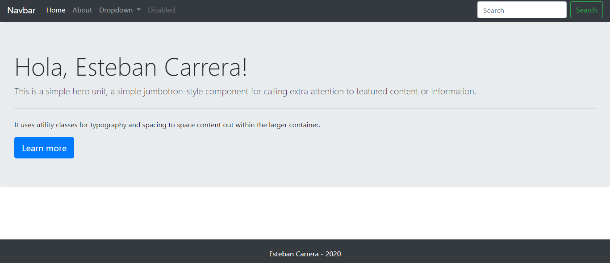
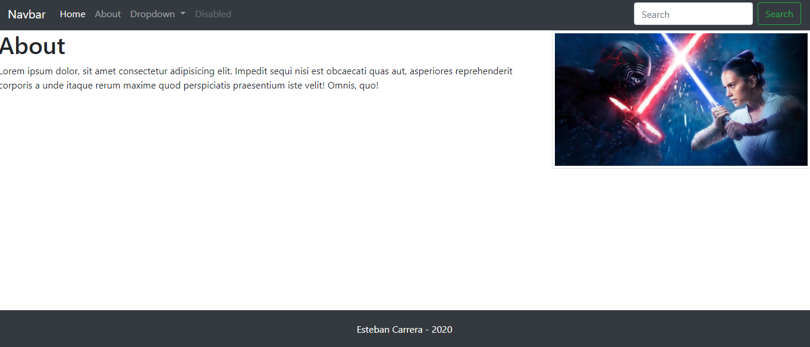

### Servidor Web + Express + HBS + Heroku
En esta aplicacion hemos implementado un servidor web que se inicializa la ayuda de la herramienta express
--
La aplicación renderiza dos paginas web en la que hemos cargado ciertas imagenes y utilizado BOOTSTRAP para su diseño
Recuerda instalar las dependencias:

```
npm install
```

Para ejecutar:

```
npm start
```
Para ejecutar en navegador:

```
localhost:2000
```
EJECUCIÓN HOME

  

EJECUCIÓN ABOUT

  

